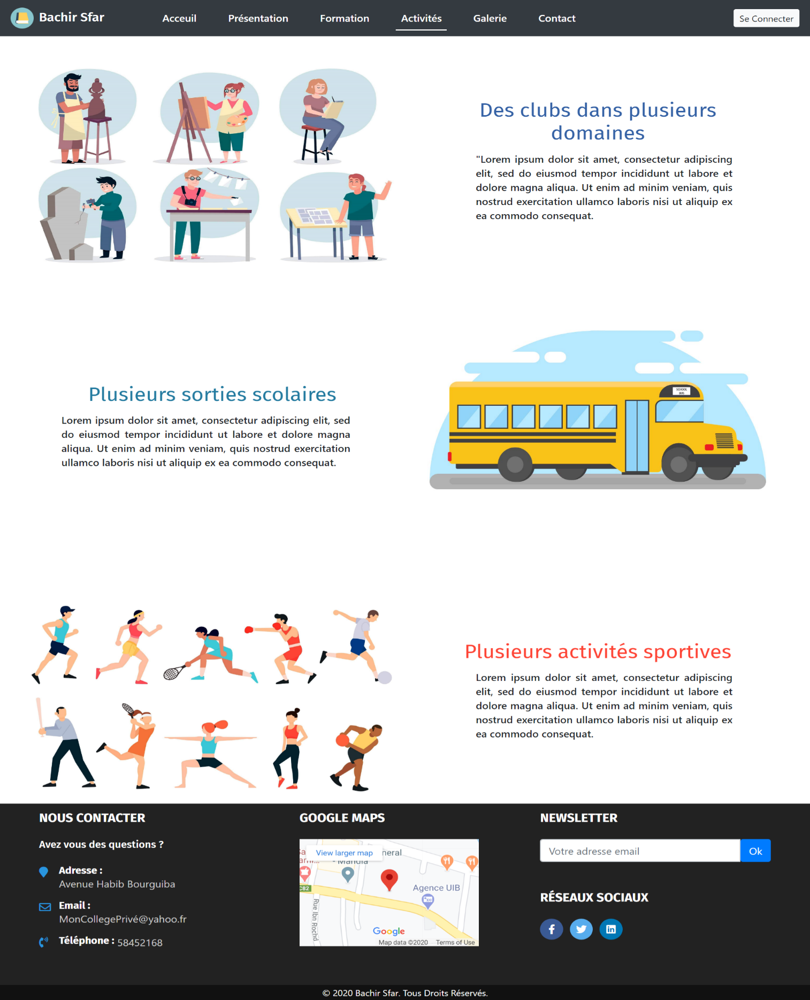
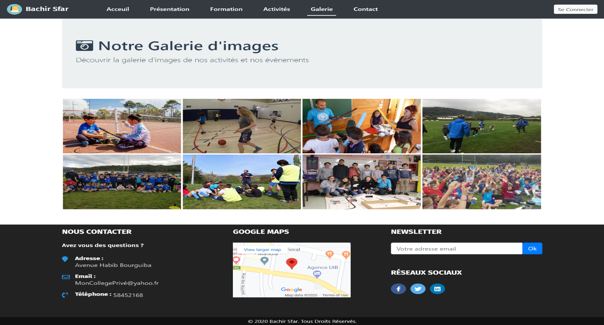
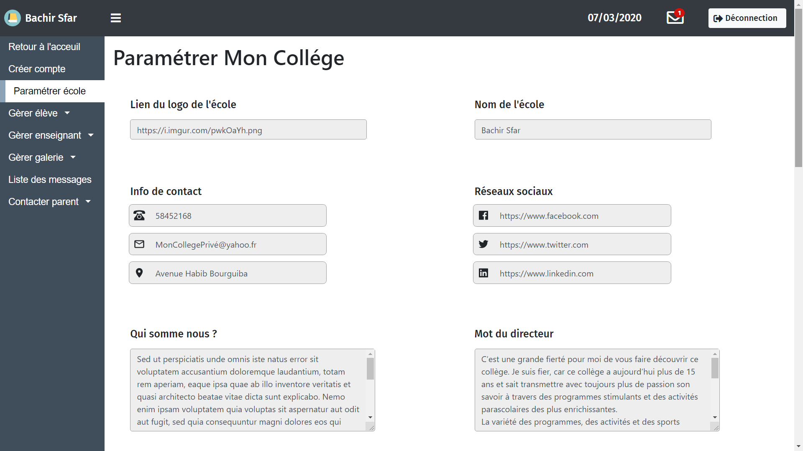
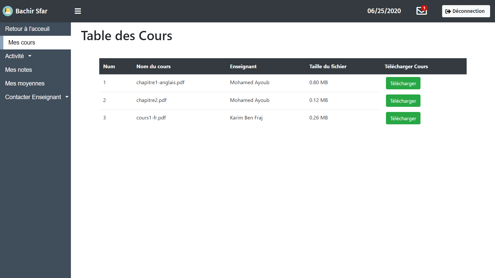
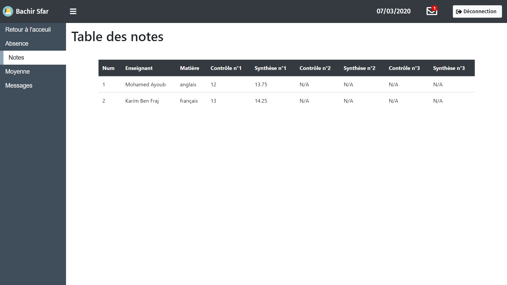
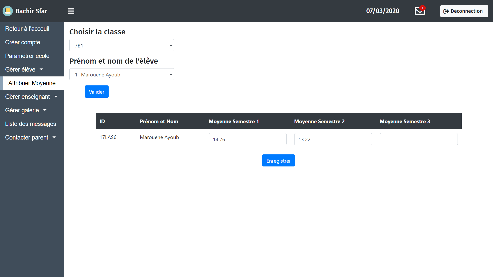
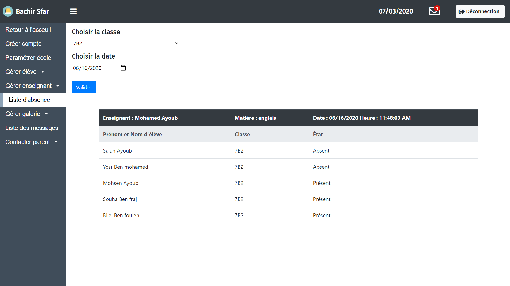
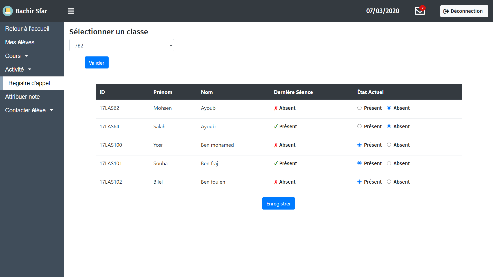

<h1 align="center">
  <br/>
  
  <h4 align="center">A School managment system built with the MERN stack</h4>
</h1>
<div align="center">


[](https://opensource.org/licenses/MIT)
</div>

<p align="center">
  <a href="#key-features">Basic overview</a> •
  <a href="#how-to-use">Key features</a> •
  <a href="#technology-used">Technology used</a> •
  <a href="#how-to-use">How to use</a> •
  <a href="#some-project-screenshots">Some Project screenshots</a> •
  <a href="#you-may-also-like">You may also like</a>
  
</p>

## Basic overview
SMS is a school managment web application built with the MERN stack that offers a variety of services to each of the four type of users (Administrators, teachers, students and guardians)

## Key features
* Daily student attendence.
* Parent monitoring feature.
* Homework and Activity Documents deployment.
* Exam marks and Result Deployment.
* Internal messaging system between students and their teachers.

## Technology used

<p align="left">
  
      
    
    
    
</p>

## How to use
To clone and run this application, you'll need [Git](https://git-scm.com) and [Node.js](https://nodejs.org/en/download/) (which comes with [npm](http://npmjs.com)) and [React Cli](https://reactjs.org/docs/create-a-new-react-app.html) installed on your computer.
From your command line:
```bash
# Clone this repository
$ git clone https://github.com/Hassene66/ProjetPFE

# Go into the repository
$ cd ProjetPFE

# Install dependencies
$ npm install

# Run the app 
$ npm run dev
```


## Some project screenshots


| | | 
|:-------------------------:|:-------------------------:|
| |  |
|  |
||
|  |  

## You may also like

- [HiCoach](https://github.com/salimkazdaghli/Hicotech-Frontend) - A coaching web app.
- [IsammLabs](https://github.com/Hassene66/IsammLabs) - A university's labs management mobile app.
